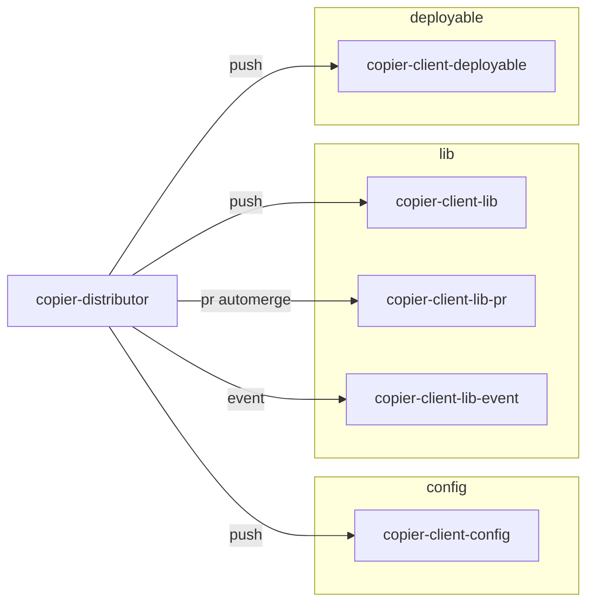

# copier-distributor

Slack channels are listed on each target (`slack` in `targets.toml`). Messaging is not integrated into this POC.

| Sync | What happens |
| --- | --- |
| **push** | Distributor runs Copier and fast-forwards the target branch. Conflicts open a PR. Default when `sync` is omitted. |
| **pr automerge** | Distributor always opens/updates `sync/template` → target branch. `gh pr merge --auto` if the merge is clean. |
| **event** | Distributor only `workflow_dispatch`es `template-sync.yml` on the client. The client runs Copier and pushes. PR dry-run logs the call and does not dispatch. |