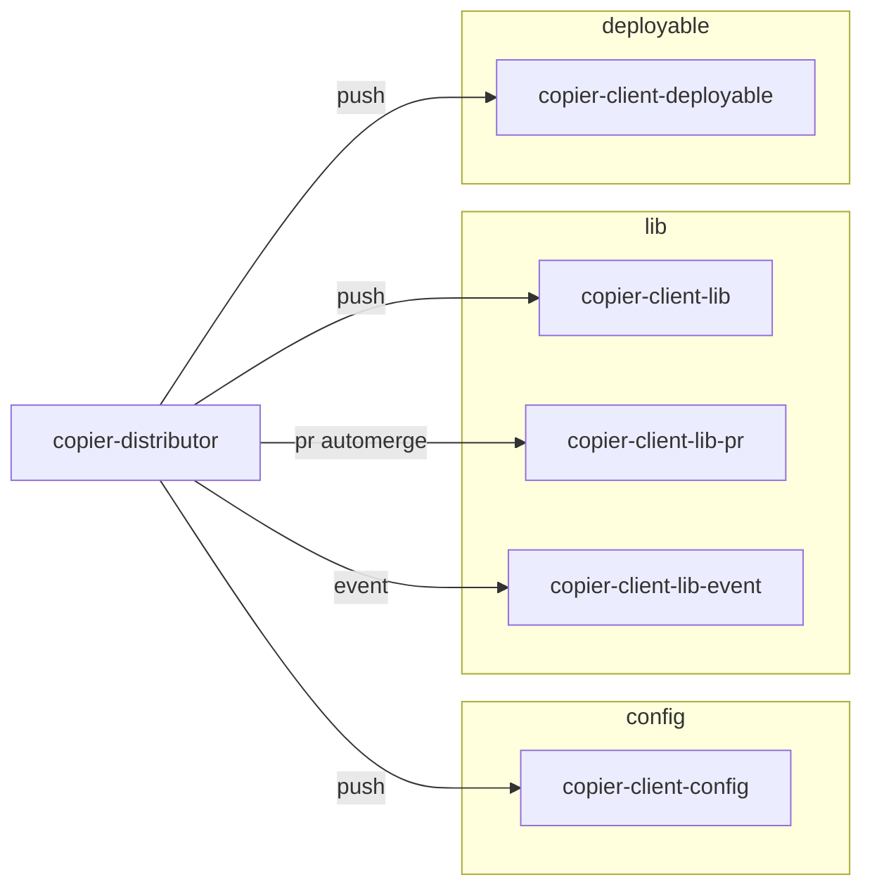

# copier-distributor

```mermaid
flowchart LR
  D[copier-distributor]
  subgraph config
    C[copier-client-config]
  end
  subgraph lib
    L[copier-client-lib]
    LP[copier-client-lib-pr]
    LE[copier-client-lib-event]
  end
  subgraph deployable
    Dep[copier-client-deployable]
  end
  D -->|push| C
  D -->|push| L
  D -->|pr automerge| LP
  D -->|event| LE
  D -->|push| Dep
```